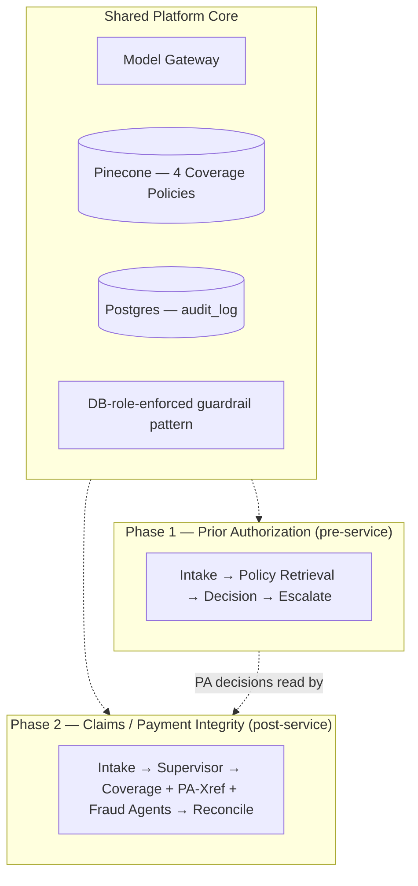
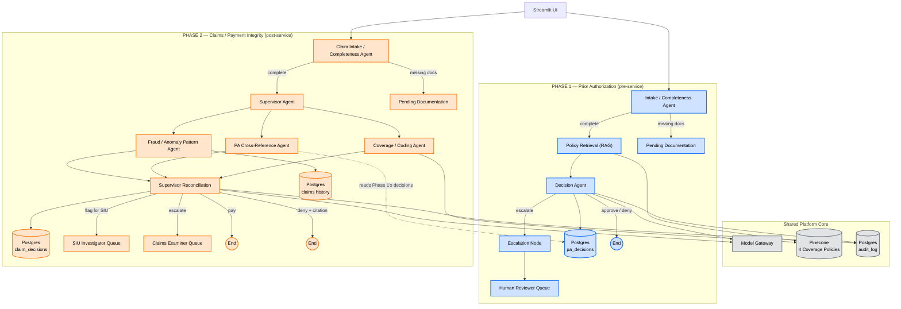

# UM-PI Agent Platform — Prior Authorization + Claims (Payment Integrity)

An agentic AI platform for a health payer, covering both sides of the same
service lifecycle: **Phase 1 (Prior Authorization)** decides pre-service
requests — retrieves the relevant coverage policy, evaluates the request
against it, and returns approve / deny-with-citation / escalate. **Phase 2
(Claims / Payment Integrity)** decides post-service claims — a supervisor
dispatches to three specialist agents (Coverage, PA Cross-Reference, Fraud)
that reconcile into pay / deny-with-citation / flag-for-SIU / escalate. Both
phases share one platform core and are fully built and verified end-to-end
with real LLM reasoning (see `BUILD_NOTES.md`).

## One framework, two phases — not two separate systems

There is a single shared platform core (policy RAG, DB-role-enforced
guardrails, model gateway, audit log), and Phase 1 (PA) and Phase 2 (Claims)
are two different agent graphs built on top of that same core. Phase 2 also
directly reads Phase 1's own decisions (the PA Cross-Reference Agent queries
`pa_decisions`) — genuine integration, not just shared infrastructure:



Full diagrams with every component are in the HLDs linked below.

## Combined Architecture — Phase 1 + Phase 2

Every component from both HLDs in one diagram, color-coded so it's visually
obvious what's shared, what's Phase 1, and what's Phase 2 — and where they
actually connect (the dotted line: Phase 2's PA Cross-Reference Agent reads
Phase 1's real decisions out of `pa_decisions`).



**Blue = Phase 1 (Prior Authorization)** · **Orange = Phase 2 (Claims /
Payment Integrity)** · **Gray = Shared Platform Core**. Notice Phase 1 is a
single linear path (one agent, one branch point) while Phase 2 fans out to
three specialist agents before reconciling — that asymmetry is deliberate,
not inconsistent design; Section 3 of the Phase 2 HLD explains why Phase 2's
decision structure actually requires it and Phase 1's didn't.

## Design documents (`docs/`)

Read in order — each one assumes the last is settled:

1. **[01-Usecase-Document.md](docs/01-Usecase-Document.md)** — problem
   statement, regulatory driver (CMS-0057-F), actors, scope, user scenarios,
   success metrics
2. **[02-High-Level-Design.md](docs/02-High-Level-Design.md)** — architecture,
   components, data stores, orchestration pattern
3. **[03-Low-Level-Design.md](docs/03-Low-Level-Design.md)** — DB schema,
   Pydantic schemas, LangGraph node/edge definitions, tool signatures,
   prompt structure

**Phase 2 (Claims / Payment Integrity)** — designed, built, and verified:

4. **[04-Claims-Usecase-Document.md](docs/04-Claims-Usecase-Document.md)** —
   problem statement, scope (full scope, including the fraud/anomaly
   pattern agent), user scenarios, and exactly what this phase reuses from
   Phase 1 vs. builds new (Section 10)
5. **[05-Claims-High-Level-Design.md](docs/05-Claims-High-Level-Design.md)** —
   architecture and diagram for the supervisor + three-specialist-agent
   design, why multi-agent is genuinely justified here (unlike Phase 1),
   data stores
6. **[06-Claims-Low-Level-Design.md](docs/06-Claims-Low-Level-Design.md)** —
   table schemas, guardrail roles, Pydantic schemas, deterministic
   reconciliation logic (fixed priority rules, not an LLM call), rule-based
   fraud signal computation, tool signatures, eval plan

## What's built vs. what's proven

**[BUILD_NOTES.md](BUILD_NOTES.md)** is the important one before you touch
anything else — both phases are fully built and verified end-to-end with
real LLM reasoning against your own Anthropic + Pinecone keys:
- **Phase 1**: 100% decision accuracy, 100% citation correctness, 0%
  false-escalation rate. Full Streamlit UI, all four PA tabs confirmed
  working live.
- **Phase 2**: 100% decision accuracy, 100% citation correctness, 0%
  false-escalation, 0% false-SIU-flag. Full Streamlit UI extension, all four
  claims tabs (Submit Claim, Claims & Decisions, SIU Queue, Claims Examiner
  Queue).

See that file for the real bugs each eval run caught and fixed along the
way — they're better evidence of engineering rigor than a clean run would
have been, and Phase 2's debugging in particular untangled three genuinely
separate issues that a threshold change alone would have masked without
fixing any of them.

## Repo structure

```
docs/                       # design documents, read in order above
data/policy/                # 4 coverage policy documents (synthetic)
data/synthetic_requests/    # seed.sql — 14 synthetic PA requests (with clinical_notes)
data/claims/                # seed_claims.sql — 17 synthetic claims (9 background + 8 scored)
eval/
  test_cases.jsonl          # Phase 1 — 14 cases with expected outcomes
  run_eval.py                 # Phase 1 — runs all 14 through the REAL decision agent + Pinecone
  eval_results.json            # written by run_eval.py
  claims_test_cases.jsonl     # Phase 2 — 8 cases with expected outcomes
  run_claims_eval.py           # Phase 2 — runs all 8 through the REAL claims graph
  claims_eval_results.json     # written by run_claims_eval.py
scripts/
  schema.sql                    # Phase 1 Postgres tables
  schema_claims.sql             # Phase 2 Postgres tables (claims, claim_documents, claim_decisions)
  setup_db_roles.sql            # Phase 1 guardrail roles (pa_agent_role, pa_intake_role, pa_admin_role)
  setup_claims_db_roles.sql     # Phase 2 guardrail roles (claims_agent_role, claims_intake_role) + extends pa_admin_role
  generate_synthetic_data.py     # regenerates Phase 1 synthetic data
  generate_synthetic_claims.py    # regenerates Phase 2 synthetic data — ALWAYS re-run this (not
                                    # just reload a handed-off .sql) so seed SQL and eval JSONL stay in sync
  ingest_policy_pinecone.py       # policy chunking + Pinecone upsert (--dry-run works without credentials)
src/
  schemas.py                      # Phase 1 + Phase 2 Pydantic models
  config.py                       # model gateway, thresholds, required-docs checklists (both phases)
  audit.py                        # append-only audit log, shared across both phases
  orchestrator.py                  # Phase 1 LangGraph wiring (linear)
  claims_orchestrator.py            # Phase 2 LangGraph wiring (parallel dispatch/join + reconcile)
  ui.py                             # Streamlit app — 8 tabs across both phases
  agents/
    intake_agent.py                 # Phase 1 — documentation completeness (no LLM)
    decision_agent.py               # Phase 1 — policy evaluation + citation validation/retry
    claim_intake_agent.py            # Phase 2 — completeness + duplicate detection (no LLM)
    coverage_agent.py                 # Phase 2 — near-verbatim reuse of decision_agent.py's pattern
    pa_xref_agent.py                   # Phase 2 — pure DB lookup against Phase 1's pa_decisions (no LLM)
    fraud_agent.py                      # Phase 2 — reasons over precomputed signals only
    reconciliation.py                    # Phase 2 — deterministic priority-rule decision logic (no LLM)
  tools/
    db_tools.py                     # Phase 1 — three DB roles (agent / intake / admin)
    claims_db_tools.py                # Phase 2 — three DB roles + queue/reviewer functions
    policy_tools.py                   # Pinecone retrieval + effective-date filtering (shared)
    fraud_signals.py                    # Phase 2 — rule-based volume/threshold anomaly computation
tests/
  test_intake_agent.py             # Phase 1 — 14/14 against live DB
  test_orchestrator_routing.py      # Phase 1 — 6/6, scripted model
  test_claim_intake_agent.py        # Phase 2 — 8/8 against live DB
  test_fraud_signals.py               # Phase 2 — 2/2, real anomaly vs. normal provider
  test_coverage_agent.py               # Phase 2 — 4/4, scripted model
  test_pa_xref_agent.py                 # Phase 2 — 9/9, all five branches
  test_reconciliation.py                # Phase 2 — 8/8, pure function, scripted signals
  test_fraud_agent.py                    # Phase 2 — 4/4, scripted model + real computed signals
  test_claims_orchestrator.py             # Phase 2 — 5/5, empirically proves the parallel join
```

## Setup

Full walkthrough, in order. Written for macOS with Homebrew; substitute your
package manager's equivalents elsewhere.

### 0. Prerequisites

```bash
brew install postgresql@16 python@3.11
brew services start postgresql@16
```

### 1. Clone the repo and set up a Python environment

```bash
git clone <your repo url>
cd um-pi-agent-platform    # or whatever you named it

python3 -m venv venv
source venv/bin/activate
pip install -r requirements.txt
```

`requirements.txt` isn't something you "run" — `pip install -r` reads it and
installs each package. `psycopg2-binary` (the Postgres driver) is the binary
build, so it shouldn't need Postgres's dev headers, but if it fails to
install, `brew install postgresql@16` (already done in step 0) usually fixes
it.

### 2. Configure your environment

```bash
cp .env.example .env
```

Fill in: `ANTHROPIC_API_KEY`, `PINECONE_API_KEY`, `OPENAI_API_KEY`, and pick
values for `DB_PASSWORD`, `DB_ADMIN_PASSWORD`, and `DB_INTAKE_PASSWORD` — one
per database role (see Step 4). You'll set the actual database roles to
these same passwords, so whatever you choose here has to match there.

### 3. Create the database and load the schema

```bash
createdb pa_agent_poc
psql -d pa_agent_poc -f scripts/schema.sql
```

### 4. Create the guardrail roles and set their passwords

```bash
psql -d pa_agent_poc -f scripts/setup_db_roles.sql

# The script creates all three roles with a placeholder password — set the
# real ones to match your .env (Step 2) now. Three roles, three distinct
# jobs: pa_agent_role decides, pa_intake_role submits, pa_admin_role reviews
# and audits. None of them can do another's job — that's the guardrail.
psql -d pa_agent_poc -c "ALTER ROLE pa_agent_role WITH PASSWORD '<your DB_PASSWORD>';"
psql -d pa_agent_poc -c "ALTER ROLE pa_admin_role WITH PASSWORD '<your DB_ADMIN_PASSWORD>';"
psql -d pa_agent_poc -c "ALTER ROLE pa_intake_role WITH PASSWORD '<your DB_INTAKE_PASSWORD>';"
```

### 5. Load the synthetic seed data

```bash
psql -d pa_agent_poc -f data/synthetic_requests/seed.sql
```

### 6. Sanity-check the guardrail before trusting anything downstream

This should succeed (read) and then fail (write) — if the second command
does **not** fail with "permission denied," stop and check step 4 before
going further.

```bash
PGPASSWORD='<your DB_PASSWORD>' psql -h localhost -U pa_agent_role -d pa_agent_poc \
    -c "SELECT service_code, status FROM pa_requests LIMIT 3;"

PGPASSWORD='<your DB_PASSWORD>' psql -h localhost -U pa_agent_role -d pa_agent_poc \
    -c "UPDATE pa_requests SET status = 'hacked';"
# expected: ERROR: permission denied for table pa_requests
```

### 7. Verify the DB layer end-to-end (no LLM keys needed yet)

```bash
python tests/test_intake_agent.py
```

Expect `14/14 scenarios correct` — this exercises the intake agent, the
restricted DB role, and the audit log together for real.

### 8. Ingest the policy documents

```bash
# Dry run first — tests chunking/metadata extraction without touching Pinecone
python scripts/ingest_policy_pinecone.py --dry-run

# Then for real, once PINECONE_API_KEY / OPENAI_API_KEY are set in .env
python scripts/ingest_policy_pinecone.py
```

### 9. Verify the graph routing logic (still no LLM keys needed)

```bash
python tests/test_orchestrator_routing.py
```

Expect `6/6 routing scenarios correct` — this runs the actual compiled
LangGraph with a scripted fake model, proving the wiring itself (citation
retry, confidence-threshold override, malformed-output handling) independent
of real model quality.

### 10. Run the real eval — actual LLM reasoning, actual Pinecone retrieval

```bash
python eval/run_eval.py
```

This is the one step everything before it was building toward: real
Anthropic calls, real retrieval against the policies you ingested in Step 8,
scored against all 14 known-outcome cases. Expect 100% decision accuracy,
100% citation correctness on the deny cases, and 0% false-escalation — if
your numbers are meaningfully different, something in Steps 1–9 didn't take;
recheck before moving on. Full per-case output is written to
`eval/eval_results.json`.

### 11. Launch the UI

```bash
streamlit run src/ui.py
```

Eight tabs across both phases: PA submit/decide, PA requests & decisions, PA
reviewer queue, claim submit/decide, claims & decisions, SIU queue, claims
examiner queue, and a shared audit log searchable by either a PA request ID
or a claim ID. The Submit Request/Claim and Reviewer/SIU/Examiner queue tabs
use `pa_intake_role`/`claims_intake_role` and `pa_admin_role` respectively —
if a tab errors on load, double check the relevant password landed
correctly in `.env`.

---

## Phase 2 setup (once Phase 1 above is working)

### 12. Add the Phase 2 database schema and guardrail roles

```bash
psql -d pa_agent_poc -f scripts/schema_claims.sql
psql -d pa_agent_poc -f scripts/setup_claims_db_roles.sql

psql -d pa_agent_poc -c "ALTER ROLE claims_agent_role WITH PASSWORD '<your DB_CLAIMS_PASSWORD>';"
psql -d pa_agent_poc -c "ALTER ROLE claims_intake_role WITH PASSWORD '<your DB_CLAIMS_INTAKE_PASSWORD>';"
```

Add `DB_CLAIMS_PASSWORD` and `DB_CLAIMS_INTAKE_PASSWORD` to your `.env` —
two more roles, same three-way separation (decide / submit / review) as
Phase 1's roles, not a shortcut through them.

### 13. Load the synthetic claims data

```bash
python scripts/generate_synthetic_claims.py
psql -d pa_agent_poc -f data/claims/seed_claims.sql
```

Always regenerate via the Python script rather than only reloading a `.sql`
file someone hands you — the script produces `seed_claims.sql` and
`eval/claims_test_cases.jsonl` together from one source, and they **must**
stay in sync (a real bug in this project's own history came from exactly
this drifting apart).

**Prerequisite**: several claims scenarios reference real Phase 1 PA
decisions by `request_id` — if `pa_decisions` is empty (a fresh DB), run
Phase 1's `eval/run_eval.py` at least once first.

### 14. Verify the Phase 2 DB layer, guardrails, and pure-logic pieces

```bash
python tests/test_claim_intake_agent.py     # expect 8/8
python tests/test_fraud_signals.py           # expect 2/2
python tests/test_reconciliation.py          # expect 8/8 — pure function, no DB/LLM needed
```

### 15. Verify the Phase 2 agents and orchestrator (scripted models, no live LLM needed yet)

```bash
python tests/test_coverage_agent.py      # expect 4/4
python tests/test_pa_xref_agent.py        # expect 9/9 — seeds its own PA fixtures; see the
                                            # in-file warning about truncating pa_decisions first
python tests/test_fraud_agent.py           # expect 4/4
python tests/test_claims_orchestrator.py    # expect 5/5
```

### 16. Run the real Phase 2 eval — actual LLM reasoning across all three specialist agents

```bash
python eval/run_claims_eval.py
```

Expect 100% decision accuracy, 100% citation correctness, 0%
false-escalation, 0% false-SIU-flag. Full per-case output written to
`eval/claims_eval_results.json`. If `pa_decisions` was empty going in (see
Step 13's prerequisite), the PA-linked scenarios will show `missing` instead
of `matches`/`denied` — that's stale prerequisite data, not a Phase 2 bug.

## Next steps

Both phases are complete and verified — see `BUILD_NOTES.md` for the full
detail, including the real bugs each eval run caught along the way. From
here, the natural next directions (not yet started): a possible Phase 3
(appeals workflow, flagged in both Claims documents as deliberately
deferred), or packaging this project for interview presentation (the eval
numbers and the debugging history are the strongest material — see
`BUILD_NOTES.md`).
