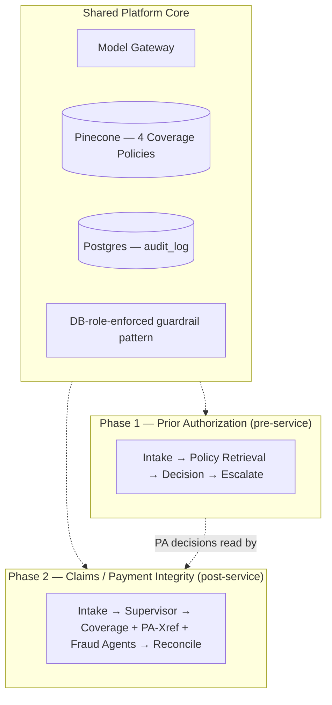
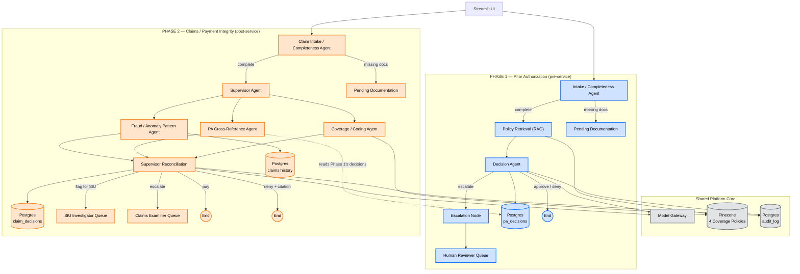

# Prior Authorization Agent — POC

An agentic AI system for a health payer that decides prior authorization
requests: retrieves the relevant coverage policy, evaluates the request
against it, and returns approve / deny-with-citation / escalate — with a
full audit trail and DB-enforced guardrails. Built as Phase 1 of a shared
PA + claims agentic platform (see `docs/01-Usecase-Document.md` Section 10
for what Phase 2 reuses).

## One framework, two phases — not two separate systems

There is a single shared platform core (policy RAG, DB-role-enforced
guardrails, model gateway, audit log), and Phase 1 (PA) and Phase 2 (Claims)
are two different agent graphs built on top of that same core. Phase 2 also
directly reads Phase 1's own decisions (the PA Cross-Reference Agent queries
`pa_decisions`) — genuine integration, not just shared infrastructure:



Full diagrams with every component are in the HLDs linked below.

## Combined Architecture — Phase 1 + Phase 2

Every component from both HLDs in one diagram, color-coded so it's visually
obvious what's shared, what's Phase 1, and what's Phase 2 — and where they
actually connect (the dotted line: Phase 2's PA Cross-Reference Agent reads
Phase 1's real decisions out of `pa_decisions`).



**Blue = Phase 1 (Prior Authorization)** · **Orange = Phase 2 (Claims /
Payment Integrity)** · **Gray = Shared Platform Core**. Notice Phase 1 is a
single linear path (one agent, one branch point) while Phase 2 fans out to
three specialist agents before reconciling — that asymmetry is deliberate,
not inconsistent design; Section 3 of the Phase 2 HLD explains why Phase 2's
decision structure actually requires it and Phase 1's didn't.

## Design documents (`docs/`)

Read in order — each one assumes the last is settled:

1. **[01-Usecase-Document.md](docs/01-Usecase-Document.md)** — problem
   statement, regulatory driver (CMS-0057-F), actors, scope, user scenarios,
   success metrics
2. **[02-High-Level-Design.md](docs/02-High-Level-Design.md)** — architecture,
   components, data stores, orchestration pattern
3. **[03-Low-Level-Design.md](docs/03-Low-Level-Design.md)** — DB schema,
   Pydantic schemas, LangGraph node/edge definitions, tool signatures,
   prompt structure

**Phase 2 (Claims / Payment Integrity)** — design in progress, not yet coded:

4. **[04-Claims-Usecase-Document.md](docs/04-Claims-Usecase-Document.md)** —
   problem statement, scope (full scope, including the fraud/anomaly
   pattern agent), user scenarios, and exactly what this phase reuses from
   Phase 1 vs. builds new (Section 10)
5. **[05-Claims-High-Level-Design.md](docs/05-Claims-High-Level-Design.md)** —
   architecture and diagram for the supervisor + three-specialist-agent
   design, why multi-agent is genuinely justified here (unlike Phase 1),
   data stores, open questions for the LLD (which comes next)
6. **[06-Claims-Low-Level-Design.md](docs/06-Claims-Low-Level-Design.md)** —
   new table schemas, guardrail roles, Pydantic schemas, deterministic
   reconciliation logic (fixed priority rules, not an LLM call), rule-based
   fraud signal computation, tool signatures, eval plan. Code comes next.

## What's built vs. what's proven

**[BUILD_NOTES.md](BUILD_NOTES.md)** is the important one before you touch
anything else — it lists exactly what has been run for real (DB guardrails
tested adversarially, intake agent run against all 14 scenarios, the actual
compiled LangGraph run end-to-end with a scripted model, policy chunking run
against the real policy docs) versus what's written but not yet exercised
(real LLM reasoning quality, real Pinecone retrieval — both need API keys
this build environment didn't have).

## Repo structure

```
docs/                       # design documents, read in order above
data/policy/                # 4 coverage policy documents (synthetic)
data/synthetic_requests/    # seed.sql — 14 synthetic PA requests
eval/test_cases.jsonl       # same 14 cases with expected outcomes, for eval
scripts/
  schema.sql                 # Postgres table definitions
  setup_db_roles.sql         # guardrail role grants (pa_agent_role, pa_admin_role)
  generate_synthetic_data.py # regenerates the synthetic data above
  ingest_policy_pinecone.py  # policy chunking + Pinecone upsert (--dry-run works without credentials)
src/
  schemas.py                 # PARequest, PolicyChunk, Decision, GraphState
  config.py                  # model gateway, escalation threshold, required-docs checklist
  audit.py                   # append-only audit log read/write
  orchestrator.py             # LangGraph wiring
  agents/
    intake_agent.py           # documentation completeness check (no LLM needed)
    decision_agent.py         # policy evaluation + citation validation/retry
  tools/
    db_tools.py                # restricted DB queries
    policy_tools.py             # Pinecone retrieval + effective-date filtering
tests/
  test_intake_agent.py         # runs intake against all 14 scenarios via live DB
  test_orchestrator_routing.py # runs the real compiled graph with a scripted model
```

## Setup

Full walkthrough, in order. Written for macOS with Homebrew; substitute your
package manager's equivalents elsewhere.

### 0. Prerequisites

```bash
brew install postgresql@16 python@3.11
brew services start postgresql@16
```

### 1. Clone the repo and set up a Python environment

```bash
git clone <your repo url>
cd um-pi-agent-platform    # or whatever you named it

python3 -m venv venv
source venv/bin/activate
pip install -r requirements.txt
```

`requirements.txt` isn't something you "run" — `pip install -r` reads it and
installs each package. `psycopg2-binary` (the Postgres driver) is the binary
build, so it shouldn't need Postgres's dev headers, but if it fails to
install, `brew install postgresql@16` (already done in step 0) usually fixes
it.

### 2. Configure your environment

```bash
cp .env.example .env
```

Fill in: `ANTHROPIC_API_KEY`, `PINECONE_API_KEY`, `OPENAI_API_KEY`, and pick a
`DB_PASSWORD` value — you'll set the actual database role to this same
password in step 4, so whatever you choose here has to match there.

### 3. Create the database and load the schema

```bash
createdb pa_agent_poc
psql -d pa_agent_poc -f scripts/schema.sql
```

### 4. Create the guardrail roles and set their passwords

```bash
psql -d pa_agent_poc -f scripts/setup_db_roles.sql

# The script creates the roles with a placeholder password — set the real
# ones to match your .env (DB_PASSWORD from step 2) now:
psql -d pa_agent_poc -c "ALTER ROLE pa_agent_role WITH PASSWORD '<your DB_PASSWORD>';"
psql -d pa_agent_poc -c "ALTER ROLE pa_admin_role WITH PASSWORD '<a separate admin password>';"
```

### 5. Load the synthetic seed data

```bash
psql -d pa_agent_poc -f data/synthetic_requests/seed.sql
```

### 6. Sanity-check the guardrail before trusting anything downstream

This should succeed (read) and then fail (write) — if the second command
does **not** fail with "permission denied," stop and check step 4 before
going further.

```bash
PGPASSWORD='<your DB_PASSWORD>' psql -h localhost -U pa_agent_role -d pa_agent_poc \
    -c "SELECT service_code, status FROM pa_requests LIMIT 3;"

PGPASSWORD='<your DB_PASSWORD>' psql -h localhost -U pa_agent_role -d pa_agent_poc \
    -c "UPDATE pa_requests SET status = 'hacked';"
# expected: ERROR: permission denied for table pa_requests
```

### 7. Verify the DB layer end-to-end (no LLM keys needed yet)

```bash
python tests/test_intake_agent.py
```

Expect `14/14 scenarios correct` — this exercises the intake agent, the
restricted DB role, and the audit log together for real.

### 8. Ingest the policy documents

```bash
# Dry run first — tests chunking/metadata extraction without touching Pinecone
python scripts/ingest_policy_pinecone.py --dry-run

# Then for real, once PINECONE_API_KEY / OPENAI_API_KEY are set in .env
python scripts/ingest_policy_pinecone.py
```

### 9. Verify the graph routing logic (still no LLM keys needed)

```bash
python tests/test_orchestrator_routing.py
```

Expect `6/6 routing scenarios correct` — this runs the actual compiled
LangGraph with a scripted fake model, proving the wiring itself (citation
retry, confidence-threshold override, malformed-output handling) independent
of real model quality.

## Next steps

See the end of `BUILD_NOTES.md` for full detail — in short, once steps 0–9
above are done: build `eval/run_eval.py` to run all 14
`eval/test_cases.jsonl` cases through the **real** decision agent (this is
the first point where actual LLM reasoning quality gets measured, not
assumed), tune `ESCALATION_THRESHOLD` from those results, then build the
Streamlit UI (`src/ui.py`).
