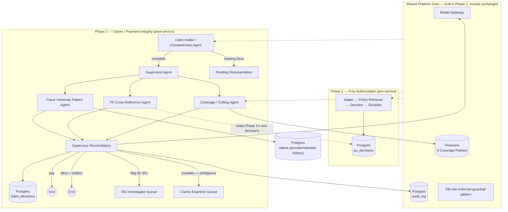

# Claims / Payment Integrity Agent — High-Level Design (HLD)

**Project**: Agentic AI Payer Platform — Phase 2 (Claims / Payment Integrity)
**Status**: Draft
**Scope**: Full scope, per the scope decision — includes the fraud/anomaly
pattern agent and genuine multi-agent architecture (see
`docs/04-Claims-Usecase-Document.md` for why this phase, unlike Phase 1,
actually requires it)

---

## 1. Design Goals (from the Use Case Document)

- Reuse Phase 1's proven platform core (policy RAG, guardrail pattern, model
  gateway, audit log) rather than rebuilding it
- Add the one genuinely new capability Phase 1 structurally cannot do: reason
  over a *pattern* across many claims, not just one request in isolation
- Cross-reference every claim against Phase 1's own PA decisions where one
  exists — this is what makes "one platform" a true claim, not two systems
  sharing a repo
- Same non-negotiables as Phase 1: every deny cites a specific policy clause,
  every decision is auditable, nothing gets decided by guesswork when
  evidence is thin

## 2. System Overview — One Framework, Two Phase-Specific Graphs

The dotted lines are the point of this diagram: Phase 2 doesn't just resemble
Phase 1 architecturally, it **reads Phase 1's actual output** as one of its
three inputs. That's the difference between "one platform" as a slogan and
"one platform" as something demonstrably true in the dependency graph.

## 3. Why Multi-Agent Here, Unlike Phase 1

Phase 1 stayed a single linear agent deliberately — its decision structure
genuinely had only one branch point (escalate or don't), so a supervisor
pattern would have been complexity added for its own sake. Claims is
different in kind, not just in size: the Fraud/Anomaly Agent has to reason
over a provider's or member's **claim history**, which is a fundamentally
different input shape and time horizon than "evaluate this one claim,"
which is all the Coverage Agent and PA Cross-Reference Agent ever do. A
single agent cannot coherently hold both "does this claim meet policy" and
"is this part of a suspicious pattern across 40 other claims" in one
reasoning pass without one task starving the other of attention — that's
the actual architectural justification for a supervisor here, not "more
agents looks more impressive."

## 4. Components

### 4.1 Claim Intake / Completeness Agent
Same pattern as Phase 1's intake agent — deterministic checklist lookup, no
LLM call, checks the claim has the required fields/documentation for its
service code before anything downstream runs.

### 4.2 Supervisor Agent
Dispatches the claim to all three specialist agents, then reconciles their
outputs into one decision. Reconciliation logic matters: a claim can pass
Coverage and PA Cross-Reference cleanly but still get flagged if the Fraud
Agent's pattern signal is strong enough — the supervisor's job is combining
three independent signals, not just forwarding whichever one "wins."

### 4.3 Coverage / Coding Agent
The direct claims-side descendant of Phase 1's Decision Agent: retrieves the
same policy corpus, checks medical necessity and coding accuracy for the
billed service, same citation discipline (a deny without a citation is
invalid output, same hard constraint as Phase 1).

### 4.4 PA Cross-Reference Agent
Checks whether this service required a PA, whether one exists in
`pa_decisions`, and whether it was approved and matches what's being billed.
No PA on file for a service that required one is itself a strong signal
toward deny — this agent's output feeds the supervisor's reconciliation, it
doesn't make the final call alone.

### 4.5 Fraud / Anomaly Pattern Agent
Reasons over the submitting provider's (and/or member's) recent claim
history — volume, timing, clustering near review thresholds. Per the
Use Case Document's Section 8 note, this agent's outputs are only trusted
where they're grounded in **objectively anomalous, planted-in-the-data**
patterns for eval purposes (implausible volume in a short window, claims
clustered just under a known review threshold) — not vague "this looks
suspicious" judgment calls with no measurable ground truth.

### 4.6 Guardrails
Same pattern as Phase 1, new role scoped to claims: read-only on claims/PA/
member data, append-only on its own decisions and audit entries. Not a
shortcut through Phase 1's existing roles — a claims agent should no more be
able to alter PA decisions than the PA agent could alter claims.

### 4.7 SIU Queue vs. Claims Examiner Queue
Two distinct human-handoff queues, not one generic "escalation" bucket like
Phase 1 has — because they mean different things operationally. SIU is
specifically for suspected fraud/waste/abuse; a merely ambiguous single-claim
case (Phase 1-style escalation) goes to a claims examiner instead. Conflating
these would mean routine ambiguous cases pollute an investigator's queue.

## 5. Data Stores

| Store | Purpose | Access pattern |
|---|---|---|
| Postgres — `claims`, `claim_documents` (new) | Claim records and their attached documentation | New claims agent role: read-only |
| Postgres — `pa_decisions` (existing, Phase 1) | Read by the PA Cross-Reference Agent | Read-only — claims agent never writes here |
| Postgres — `claim_decisions` (new) | Final pay/deny/flag decisions | Claims agent: append-only |
| Postgres — `audit_log` (existing, shared) | Decision trail for both phases | Append-only, same table Phase 1 already writes to |
| Pinecone (existing, shared) | Same 4 policy documents | Read-only, unchanged from Phase 1 |

## 6. Orchestration Pattern

LangGraph state graph with a genuine supervisor/dispatch structure (unlike
Phase 1's single linear path): `intake → [complete?] → supervisor →
{coverage, pa_xref, fraud} → reconcile → {pay | deny | flag_siu | escalate}`.
The three specialist agents can run independently of each other (none needs
another's output to do its own job) — only the final reconciliation step
needs all three.

## 7. Non-Functional Design Notes

- **No PHI**: same as Phase 1 — synthetic claims data only, schema modeled to
  resemble a real payer's without containing real identifiers
- **False-flag cost is asymmetric**: a false SIU flag has real
  provider-relations cost beyond a wasted review cycle (per the Use Case
  Document's success metrics) — this should weigh into how conservatively the
  Fraud Agent's confidence threshold gets tuned, likely more conservatively
  than Phase 1's 0.75 default, once real eval numbers exist
- **Extensibility**: the reconciliation step is the one place a future Phase
  3 (appeals) would hook in — a denied or SIU-flagged claim's appeal would
  need the original reconciliation reasoning available, not just the final
  outcome

## 8. Open Questions for LLD

- Exact schema for `claims`, `claim_documents`, `claim_decisions`
- Exact reconciliation logic — how the supervisor weighs three
  possibly-conflicting specialist outputs into one decision, and what
  happens when they disagree
- Fraud/anomaly detection approach — rule-based signals feeding the agent's
  reasoning (e.g. claim count in a rolling window) vs. the agent doing
  open-ended pattern-spotting over raw claim history; the former is more
  eval-able and is the safer default given Section 3's warning about fuzzy
  ground truth
- Synthetic claims dataset design — same hand-authored-not-random discipline
  as Phase 1's 14 PA scenarios, including deliberately-planted duplicate and
  anomalous-pattern cases with known correct outcomes
